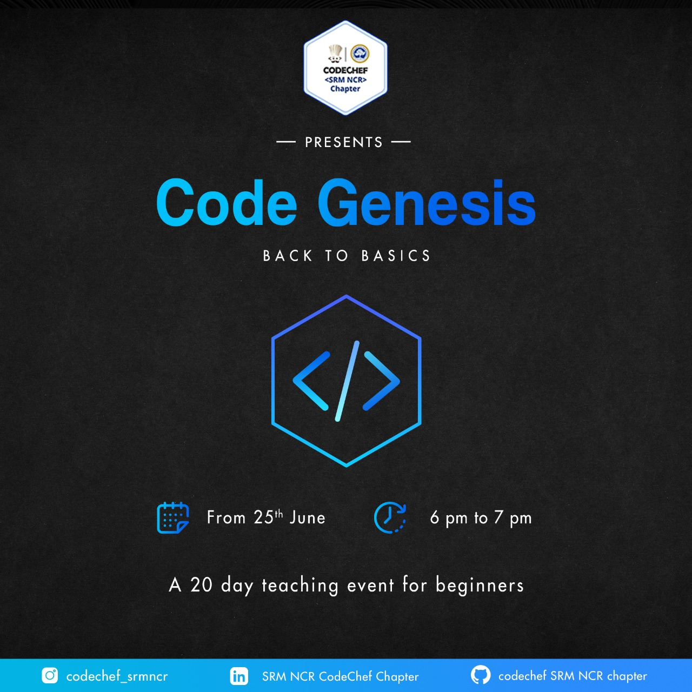

# Code Genesis
<p align="center">
  
</p>

**Code Genesis** presented by **SRM CODECHEF NCR chapter** 
A 20-day long journey by the end of which you shall have a deep rooted understanding of the Competitive Programming and will be more than equipped to begin your CP journey. <br>
Each session would be followed by set of questions for practice and doubts discussion.

***Ready; Set; Code***

## Topics
* Conditionals
* Looping 
* Arrays 
* strings
* Bit manipulation
* Functions 
* Structures/classes
* Recursion


## File Structure
```
├── answers
│   ├── someotherusername
│   │   └── Conditionals
│   │       └── question1.py
│   └── yourusername
│       ├── Conditonals
│       │   ├── question1.py
│       │   └── question2.py
│       └── Looping
│           ├── question1.py
│           └── question2.py
```

* `Answers` Folder include your solutions to the problems inside the folder of yourusername

### Steps
1. Fork this repository
2. Read Questions in the `questions` folder
3. Make a new folder with your own username in `answers`
4. Add your answer in your folder, like for conditionals - Question-1 the answer file would be `conditionals/question1.py`
5. Commit Changes
6. Open a pull request for all the changes you've made
